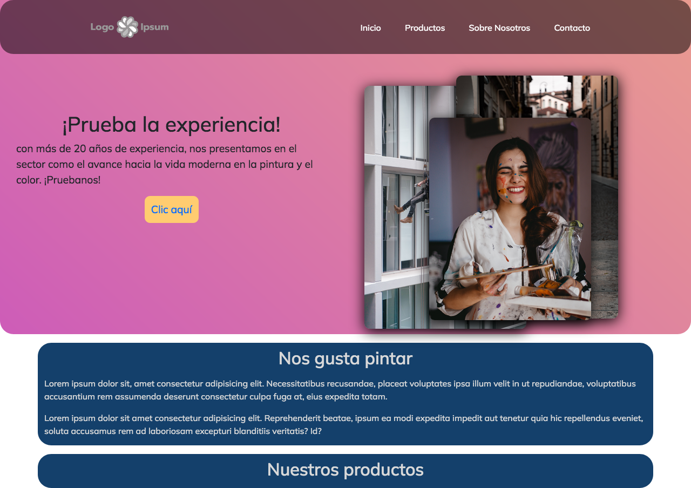
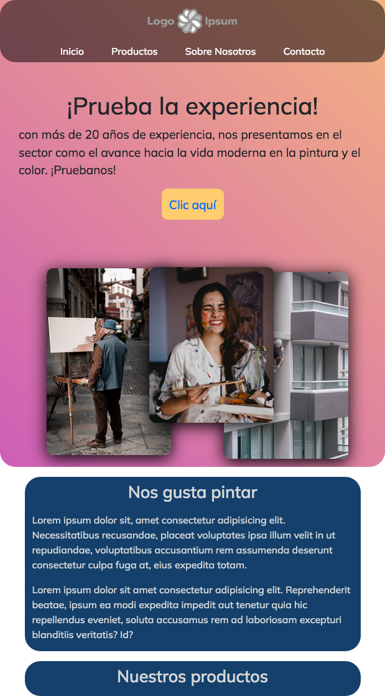

# Página con mucho color
quería probar un fondo de degradado con movimiento, además de las imagenes flotantes, y por ahora ha salido muy bien. he creado todo con bordes redondos, al estilo apple, y con una preciosa tipografía.
No tiene contenido, porque por ahora estoy practicando las cabeceras. En este caso he probado el tema de `width: 100vw`y `height: 100vh`, para ver como se comporta, y es genial. Ocupa toda parte visible del primer plano, y da mucho juego.
## screenshots & video

